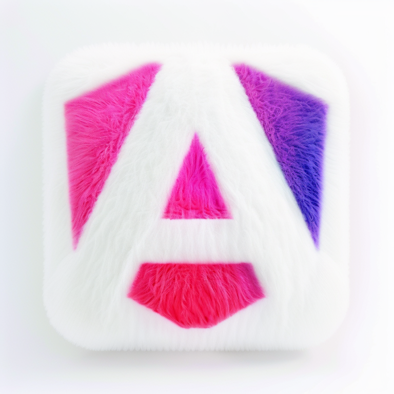
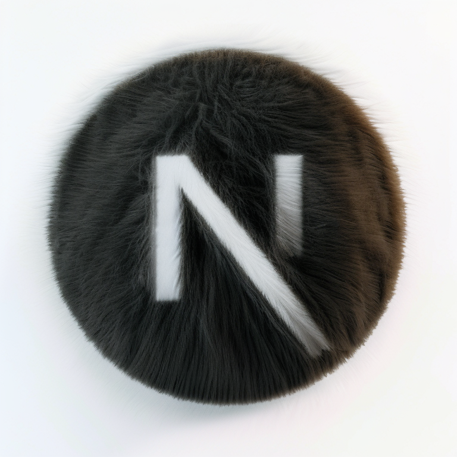
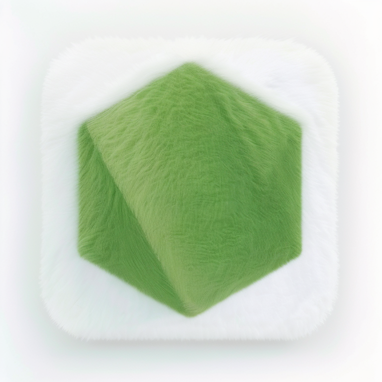

[English](./README.md) | 简体中文

## 毛茸茸风格图标

这里是用于共享 ComfyUI 工作流[毛茸茸风格图标](https://openart.ai/workflows/kejun/furryfluffy-style-icon-v11-v11/XueYOY1PYXXAHMcarWl8)生成的各种 logo 的仓库

>[!IMPORTANT]
> 如果你喜欢这个项目，希望你能给这个仓库点一个 star ⭐

## 图片列表

| 名称               | 图片                                            |
| ------------------ | ----------------------------------------------- |
| Angular            |  |
| Next.js            |   |
| Node JS            |   |
| Nuxt JS            |   |
| React              |    |
| Visual Studio Code |   |
| Vue                |      |

## 贡献

- 克隆这个仓库
- 新增 `assets/{service}/00.png` 文件夹
- 将图片放进去
- 修改 README 的 Image list

## 协议

基于 [MIT License](./LICENSE) 用 💛 发电
